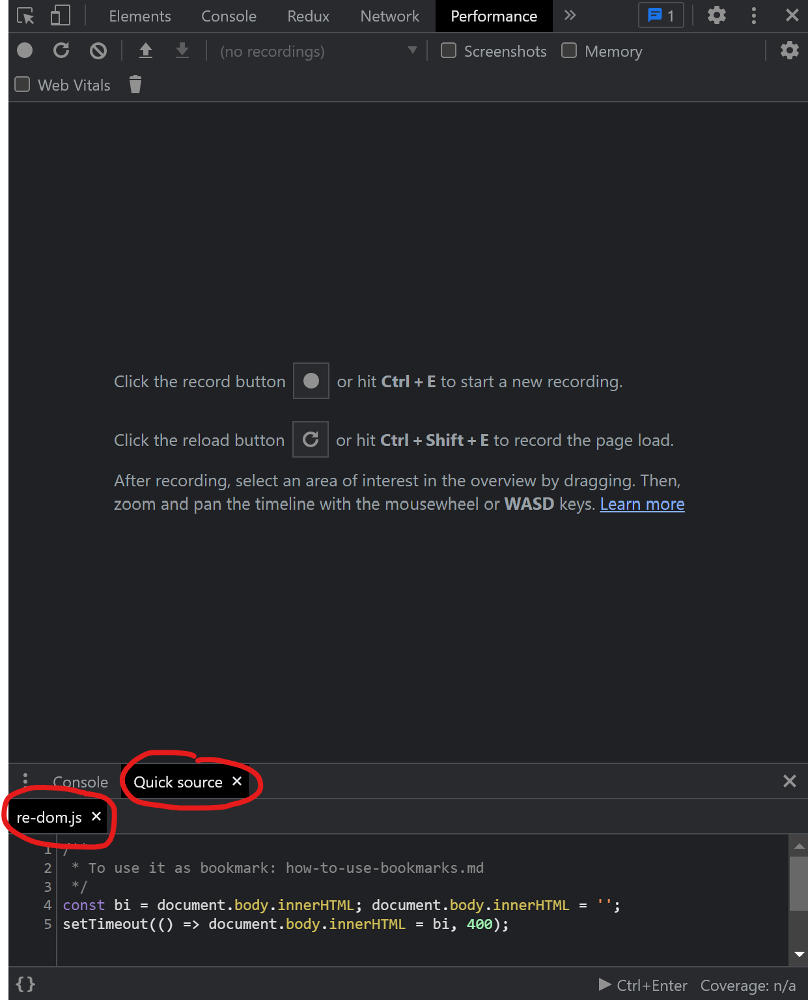

How to use Autohotkey example

1. Download and install [Autohotkey](https://www.autohotkey.com/)
2. Download the Autohotkey script: `quick-script-click.ahk`

How to use
1. Run the `quick-script-click.ahk` which will start autohotkey and load this script
  * (Autohotkey doesn't detect changes to the file unless you rerun it)
2. Prepare your browser
  1. Open performance tab and have Quick Source enabled
  2. Ensure that the script you want to run has been selected in the Quick Sources tab
  3. Position mouse curser on the Quick Source tab
  4. Press WIN + n

