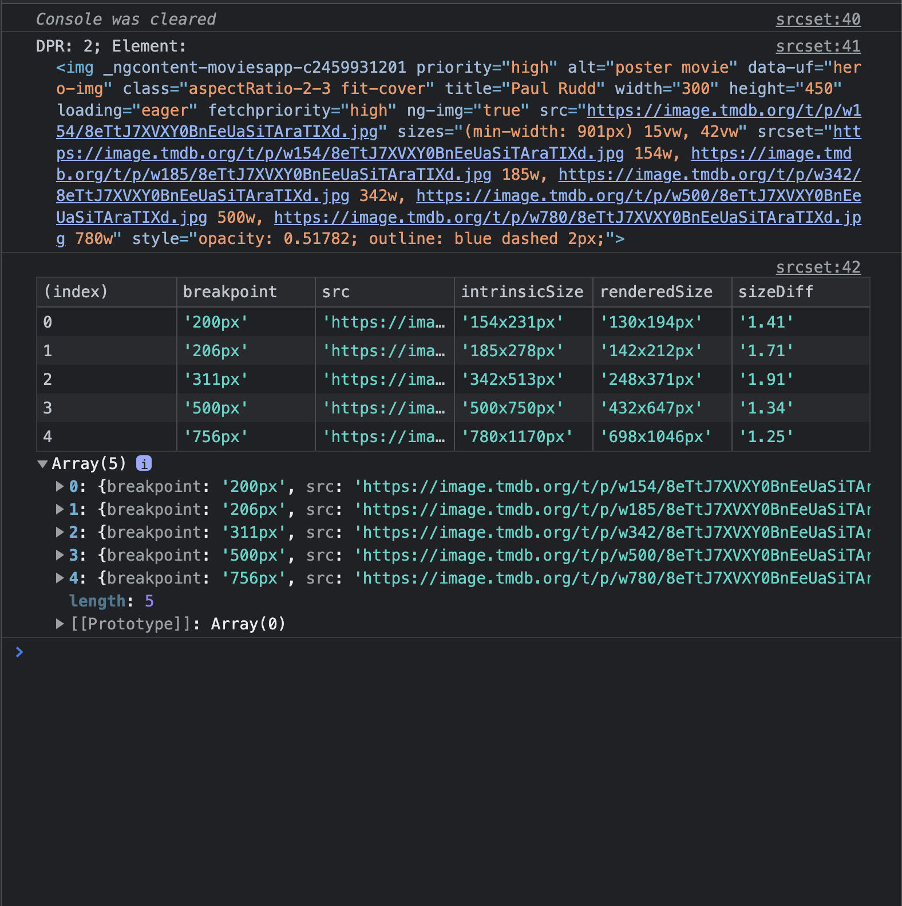
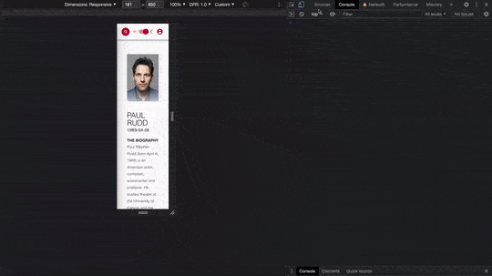

# Check image srcset

## Description
This script helps to debug srcset of [responsive images](web.dev/responsive-images). 
It prints changes in the current src and logs the current url and clientWidth. 

## How to use it

### Devtools setup
- select network tab
- disable cache
- remove all columns but name and path 
- filter for images only 
- in the net work configuration area (cog wheel) select big icons
- use the search filter to reduce the number of results
- open device toolbar
- in the menu select show device pixel ratio
- use a flexible with

### Use source snippet
- add snippet
- open quick Sources panel 
- execute script
- resize page
- watch console and screen

You will get a output in the console that updates while you resize the screen.

It includes:
- DPR
- The element you debug ATM. This is good for debugging because you can just hover the element in the console and there is no need to fiddle in the elements tab
- A table of breakpoints where the current `src` changed including the intrinsic size, rendered size and the ratio of the 2
- A log of the data in form od a normal log below the table. This is useful if the table size does not allow to see all information

  

As a visual support the selected image will get a couple of styles set to reflect the correctness:
- oversized images will get a red border where the border width is proportional to the ratio of oversize
- undersized images will get a blue border where the border width is 1px and the opacity is proportional to the undersize

| Oversize    | Undersize  |
| ----------- | ---------- |
|  |  | 

Here a small [video to see it in action](./assets/srcset-script-debugging__michael-hladky.mp4):  
[](./assets/srcset-script-debugging__michael-hladky.mp4)


<!-- START-HOW_TO[bookmark,console-tab] -->


| Technique   | Is Usable  |
| ----------- | ---------- |
| [Bookmark](https://github.com/push-based/web-performance-tools/blob/main/docs/how-to-use-it-with-bookmarks) |      ✔    | 
| [Console Tab](https://github.com/push-based/web-performance-tools/blob/main/docs/how-to-use-it-with-console-tab.md) |      ✔    | 
| [Sources Tab](https://github.com/push-based/web-performance-tools/blob/main/docs/how-to-use-it-with-sources-tab.md) |      ❌    | 
| [Chromium](https://github.com/push-based/web-performance-tools/blob/main/docs/how-to-use-it-with-chromium.md)       |      ❌    |
    


### Bookmark Snippet


<details>

<summary>Copy this code snippet into the bookmark to use it</summary>


```javascript

javascript:(() => {function checkImgSrcset(selector) {
    selector = selector || prompt('Img selector (e.g. div.test > img)');
    let lastSrc = '';
    const switches = [];
    const el = document.querySelector(selector);
    if (!el) {
        throw (`Could not fnd any element with selector ${selector}`);
    }
    const resizeObserver = new ResizeObserver((entries) => {
        const clientWidth = document.body.clientWidth;
        for (const entry of entries) {
            const img = entry.target;
            if (lastSrc !== img.currentSrc) {
                lastSrc = img.currentSrc;
                lastSrc && loadImg(lastSrc).then(i => {
                    switches.push({
                        clientWidth,
                        element: el,
                        src: lastSrc,
                        intrinsicWith: i.width,
                        intrinsicHeight: i.height,
                        renderedWith: el.clientWidth,
                        renderedHeight: el.clientHeight,
                        sizeDiff: ((i.width * i.height) / (el.clientWidth * el.clientHeight))
                    });
                    highlightElement(switches);
                    logData(switches);
                });
                highlightElement(switches);
                logData(switches);
            }
        }
    });
    resizeObserver.observe(el);
}
function logData(data) {
    console.clear();
    console.table(prepareTable(data));
}
function highlightElement(arr) {
    arr.forEach(o => {
        const { element, intrinsicWith, intrinsicHeight } = o;
        if (element && intrinsicWith && intrinsicHeight) {
            const d = ((intrinsicWith * intrinsicHeight) / (element.clientWidth * element.clientHeight));
            // for over-size border for under-size opacity?
            element.style.border = 1 + 'px solid red';
            element.style.opacity = 0.5 * d;
        }
    });
}
function prepareTable(arr) {
    return arr
        .map(({ element, ...inTable }) => ({
        dpr: window.devicePixelRatio,
        clientWidth: inTable.clientWidth + 'px',
        src: inTable.src,
        intrinsicSize: inTable.intrinsicWith + 'x' + inTable.intrinsicHeight + 'px',
        renderedSize: inTable.renderedWith + 'x' + inTable.renderedHeight + 'px',
        sizeDiff: inTable.sizeDiff.toFixed(2)
    }));
}
function loadImg(url) {
    return new Promise((resolve, reject) => {
        const img = new Image;
        img.onload = function () {
            resolve(img);
        };
        img.onerror = (e) => reject(e);
        img.src = url;
    });
}
;
checkImgSrcset();
})()
``` 


</details>


## Console Tab Snippet

<details>

<summary>Copy this code snippet into the DevTools console Tab to use it</summary>


```javascript

function checkImgSrcset(selector) {
    selector = selector || prompt('Img selector (e.g. div.test > img)');
    let lastSrc = '';
    const switches = [];
    const el = document.querySelector(selector);
    if (!el) {
        throw (`Could not fnd any element with selector ${selector}`);
    }
    const resizeObserver = new ResizeObserver((entries) => {
        const clientWidth = document.body.clientWidth;
        for (const entry of entries) {
            const img = entry.target;
            if (lastSrc !== img.currentSrc) {
                lastSrc = img.currentSrc;
                lastSrc && loadImg(lastSrc).then(i => {
                    switches.push({
                        clientWidth,
                        element: el,
                        src: lastSrc,
                        intrinsicWith: i.width,
                        intrinsicHeight: i.height,
                        renderedWith: el.clientWidth,
                        renderedHeight: el.clientHeight,
                        sizeDiff: ((i.width * i.height) / (el.clientWidth * el.clientHeight))
                    });
                    highlightElement(switches);
                    logData(switches);
                });
                highlightElement(switches);
                logData(switches);
            }
        }
    });
    resizeObserver.observe(el);
}
function logData(data) {
    console.clear();
    console.table(prepareTable(data));
}
function highlightElement(arr) {
    arr.forEach(o => {
        const { element, intrinsicWith, intrinsicHeight } = o;
        if (element && intrinsicWith && intrinsicHeight) {
            const d = ((intrinsicWith * intrinsicHeight) / (element.clientWidth * element.clientHeight));
            // for over-size border for under-size opacity?
            element.style.border = 1 + 'px solid red';
            element.style.opacity = 0.5 * d;
        }
    });
}
function prepareTable(arr) {
    return arr
        .map(({ element, ...inTable }) => ({
        dpr: window.devicePixelRatio,
        clientWidth: inTable.clientWidth + 'px',
        src: inTable.src,
        intrinsicSize: inTable.intrinsicWith + 'x' + inTable.intrinsicHeight + 'px',
        renderedSize: inTable.renderedWith + 'x' + inTable.renderedHeight + 'px',
        sizeDiff: inTable.sizeDiff.toFixed(2)
    }));
}
function loadImg(url) {
    return new Promise((resolve, reject) => {
        const img = new Image;
        img.onload = function () {
            resolve(img);
        };
        img.onerror = (e) => reject(e);
        img.src = url;
    });
}
;
checkImgSrcset();

``` 


</details>


<!-- END-HOW_TO -->


