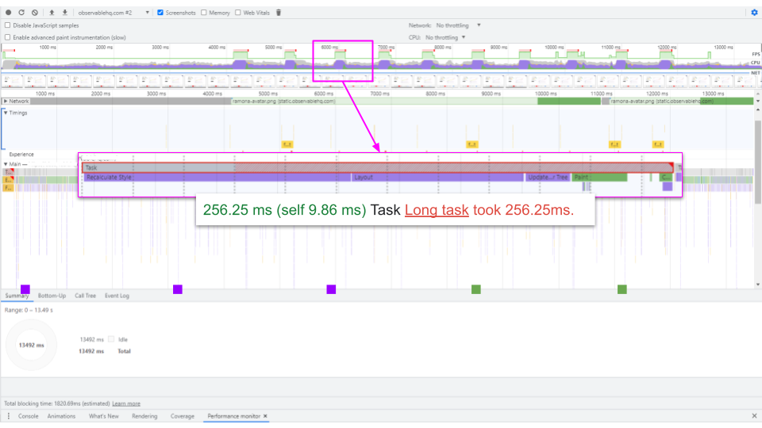
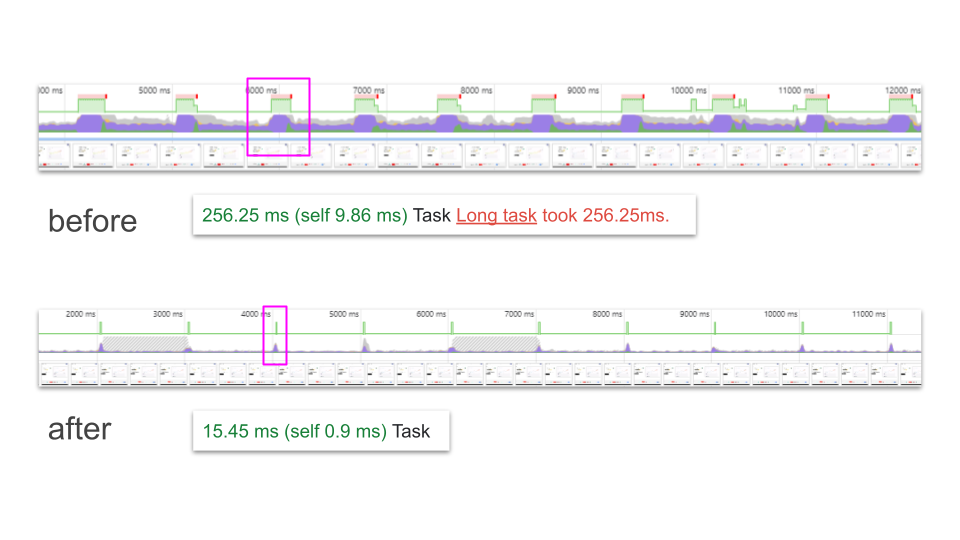

# Estimate CSS render costs

## Description

Get's estimations for a full page re-calculate styles, layout and paint. 

Changing the zoom level of the page causes recalculations of styles. 
When running the script multiple times in a row while recording in the performance tab,
you can and get rough estimations about the different parts of the DOM.

## Usage

1. Start the recording in the performance tab
2. Execute the script over one of the given options multiple times in a row with a small break inbetween
3. Stop the recording and analyze the flames



You can use it as a base measurement to compare against global CSS improvements.



## How to use it

<!-- START-HOW_TO[bookmark,console-tab,sources-tab,chromium] -->


| Technique   | Is Usable  |
| ----------- | ---------- |
| [Bookmark](https://github.com/push-based/web-performance-tools/blob/main/docs/how-to-use-it-with-bookmarks) |      ✔    | 
| [Console Tab](https://github.com/push-based/web-performance-tools/blob/main/docs/how-to-use-it-with-console-tab.md) |      ✔    | 
| [Sources Tab](https://github.com/push-based/web-performance-tools/blob/main/docs/how-to-use-it-with-sources-tab.md) |      ✔    | 
| [Chromium](https://github.com/push-based/web-performance-tools/blob/main/docs/how-to-use-it-with-chromium.md)       |      ✔    |
    


### Bookmark Snippet


<details>

<summary>Copy this code snippet into the bookmark to use it</summary>


```javascript

javascript:(() => {const b = document.body;
b.style.zoom === '1' ? b.style.zoom = '1.01' : b.style.zoom = '1';
})()
``` 


</details>


## Console Tab Snippet

<details>

<summary>Copy this code snippet into the DevTools console Tab to use it</summary>


```javascript

const b = document.body;
b.style.zoom === '1' ? b.style.zoom = '1.01' : b.style.zoom = '1';

``` 


</details>


<!-- END-HOW_TO -->


# Credits

Author: _Michael Hladky - push-based.io_  
Source: _[github.com/push-based/web-performance-tools](www.github.com/push-based/web-performance-tools)_  
